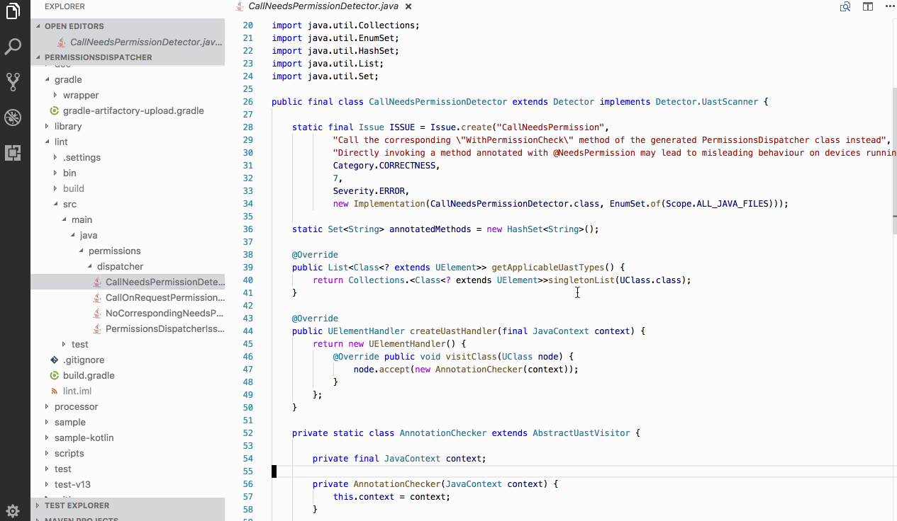

# vscode-find-pr

A vscode plugin jumps to pull request url.



## Install

- Open _Visual Studio Code_
- Press `Ctrl+Shift+X` or `⇧⌘X`
- Type `find-pr`
- Click install on _vscode-find-pr_

## Usage

- Press `Ctrl+Shift+P` or `⇧⌘P`
- Type `Find Pull Request`
  - Or Default keybind for the action `Alt+F`
- Just execute the command

## Configuration

You can configure some of plugin settings by adding below into your workspace setting file.

```sh
{
  "findpr.remote": "feature-branch", # specify target remote git repository, default is "origin"
  "findpr.showDescription": true, # open pull request description page, default is false
}
```

## Licence

```
Copyright 2018 Shintaro Katafuchi

Licensed under the Apache License, Version 2.0 (the "License");
you may not use this file except in compliance with the License.
You may obtain a copy of the License at

   http://www.apache.org/licenses/LICENSE-2.0

Unless required by applicable law or agreed to in writing, software
distributed under the License is distributed on an "AS IS" BASIS,
WITHOUT WARRANTIES OR CONDITIONS OF ANY KIND, either express or implied.
See the License for the specific language governing permissions and
limitations under the License.
```
